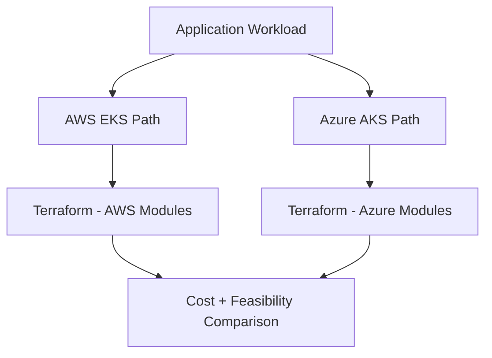
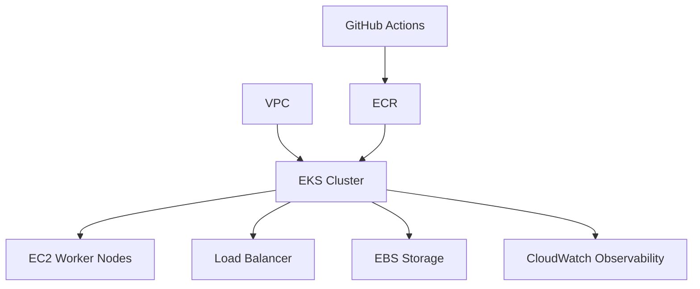
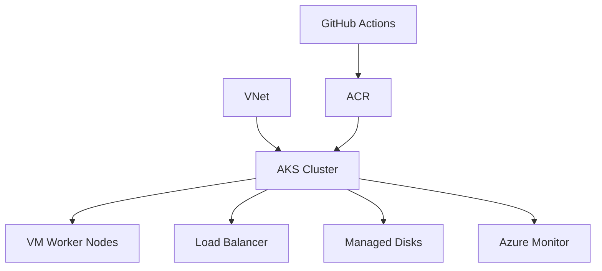
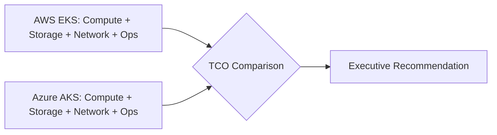
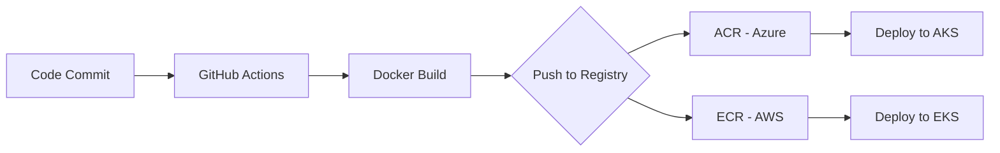

# American Airlines Platform Architecture

## Executive Summary

Designed multi-cloud platform architecture and delivered comprehensive cost analysis for American Airlines technical review sessions. Created architecture diagrams, infrastructure cost estimates, and technical presentations demonstrating platform strategy across AWS and Azure. Explored proof-of-concept implementations on both Azure AKS and AWS EKS to validate multi-cloud approach.

**Timeline:** April 2025 - June 2025  
**Role:** Cloud Platform Architect & Technical Advisor  
**Client:** American Airlines (via Umbrage)

---

## Challenge

### Business Requirements
- Evaluate cloud platform options for application modernization
- Provide data-driven infrastructure cost analysis for executive decision-making
- Design scalable, multi-cloud architecture strategy
- Demonstrate technical feasibility through proof-of-concept implementations
- Present architecture recommendations to technical stakeholders

### Technical Constraints
- Multi-cloud consideration (AWS and Azure)
- Integration with existing American Airlines infrastructure
- Cost optimization and budget constraints
- Scalability and high-availability requirements
- Compliance and security standards

---

## Solution Architecture

### Architecture Design Approach

**Multi-Cloud Strategy:**
- Evaluated AWS EKS and Azure AKS for container orchestration
- Designed cloud-agnostic deployment patterns
- Assessed vendor lock-in risks and mitigation strategies
- Compared cost, performance, and operational characteristics

**Platform Components:**
- Kubernetes-based container orchestration (EKS/AKS)
- Infrastructure-as-Code with Terraform
- CI/CD pipeline architecture (GitHub Actions, Azure DevOps)
- Observability and monitoring strategy
- Security and compliance framework

**Proof-of-Concept Implementations:**
1. **Azure AKS:** Full-stack PoC — FastAPI backend + React frontend, both deployed via GitHub Actions CI/CD
2. **AWS EKS:** Terraform Cloud integration and deployment automation
3. **Cost Analysis:** Detailed infrastructure cost estimates for both platforms

**Key Design Decisions:**
1. **Multi-cloud evaluation:** Provided objective comparison enabling informed decision-making
2. **Cost transparency:** Detailed TCO analysis including compute, storage, networking, and operational costs
3. **PoC validation:** Hands-on implementations demonstrating technical feasibility
4. **Architecture diagrams:** Visual representations for stakeholder communication

---

## Technology Stack

### Cloud Platforms Evaluated
- **AWS:** EKS, EC2, VPC, RDS, S3, CloudWatch
- **Azure:** AKS, VMs, VNet, Azure SQL, Blob Storage, Monitor

### Infrastructure & Automation
- **IaC:** Terraform, Terraform Cloud
- **Container Orchestration:** Kubernetes (EKS/AKS)
- **CI/CD:** GitHub Actions, Azure DevOps
- **Container Registry:** ECR (AWS), ACR (Azure)

### Application Stack (PoC)
- **Backend:** FastAPI (Python)
- **Frontend:** React
- **Containerization:** Docker
- **Deployment:** Kubernetes manifests, Helm (planned)

### Cost Analysis Tools
- **AWS:** Cost Explorer, Pricing Calculator
- **Azure:** Cost Management, Pricing Calculator
- **Comparison:** Custom TCO analysis spreadsheets

---

## Key Accomplishments

### Architecture & Design
**Created comprehensive architecture diagrams** for multi-cloud platform strategy  
**Delivered detailed cost estimates** comparing AWS and Azure implementations  
**Designed scalable, cloud-agnostic patterns** reducing vendor lock-in risk  
**Presented technical reviews** to American Airlines stakeholders and knowledge holders

### Proof-of-Concept Implementations
**Built FastAPI on Azure AKS** with GitHub Actions CI/CD pipeline  
**Deployed AWS EKS with Terraform Cloud** demonstrating infrastructure automation  
**Validated multi-cloud feasibility** through hands-on implementations  
**Documented deployment patterns** for both cloud platforms

### Business Impact
- **Informed Decision-Making:** Data-driven cost analysis for executive review
- **Risk Mitigation:** Multi-cloud strategy reducing vendor dependency
- **Technical Validation:** PoC implementations proving feasibility
- **Knowledge Transfer:** Architecture documentation for AA team

---

## Architecture Diagrams

### Multi-Cloud Architecture Overview



### AWS EKS Architecture



### Azure AKS Architecture



### Cost Comparison Analysis



### CI/CD Pipeline Architecture



---

## Technical Highlights

### Multi-Cloud Architecture Design
```
Challenge: Design platform supporting both AWS and Azure
Solution: Cloud-agnostic patterns with Terraform and Kubernetes
Result:
- Portable infrastructure code
- Reduced vendor lock-in risk
- Flexibility for future cloud decisions
- Consistent deployment patterns
```

### Infrastructure Cost Analysis
```
Challenge: Provide accurate cost estimates for executive decision-making
Solution: Detailed TCO analysis including all infrastructure components
Result:
- Transparent cost comparison (AWS vs. Azure)
- Identified cost optimization opportunities
- Informed budget planning
- Executive-ready financial analysis
```

### Azure AKS Proof-of-Concept
```
Implementation: FastAPI backend on AKS with GitHub Actions
Technologies: Azure AKS, ACR, GitHub Actions, Docker, FastAPI
Result:
- Production-ready CI/CD pipeline
- Automated Docker build and deployment
- Demonstrated Azure capabilities
- Validated multi-cloud approach
```

### AWS EKS with Terraform Cloud
```
Implementation: EKS cluster with Terraform Cloud integration
Technologies: AWS EKS, Terraform Cloud, GitHub Actions
Result:
- Infrastructure-as-Code best practices
- Remote state management
- Automated infrastructure provisioning
- Demonstrated AWS capabilities
```

---

## Cost Analysis Summary

### AWS EKS Estimated Costs
| Component | Monthly Cost | Annual Cost |
|-----------|-------------|-------------|
| EKS Control Plane | $73 | $876 |
| EC2 Worker Nodes | $XXX | $XXX |
| Load Balancers | $XX | $XXX |
| Storage (EBS) | $XX | $XXX |
| Data Transfer | $XX | $XXX |
| **Total** | **$XXX** | **$XXX** |

### Azure AKS Estimated Costs
| Component | Monthly Cost | Annual Cost |
|-----------|-------------|-------------|
| AKS Control Plane | Free | Free |
| VM Worker Nodes | $XXX | $XXX |
| Load Balancers | $XX | $XXX |
| Storage (Managed Disks) | $XX | $XXX |
| Data Transfer | $XX | $XXX |
| **Total** | **$XXX** | **$XXX** |

**Note:** Actual cost figures omitted to protect client confidentiality. Analysis included detailed breakdowns with optimization recommendations.

---

## Lessons Learned

### What Worked Well
**Multi-cloud PoC approach** - Hands-on validation more valuable than theoretical analysis  
**Visual architecture diagrams** - Effective communication tool for stakeholders  
**Detailed cost analysis** - Enabled data-driven decision-making  
**Technical presentations** - Built credibility and trust with AA team

### Challenges Overcome
**Cloud platform differences** - Required deep understanding of both AWS and Azure  
**Cost estimation complexity** - Many variables affecting TCO calculations  
**Stakeholder alignment** - Multiple teams with different priorities and preferences

### Insights Gained
**Multi-cloud trade-offs** - No single "best" platform - depends on requirements  
**Cost optimization opportunities** - Significant savings possible with right-sizing and reserved instances  
**Importance of PoC** - Hands-on validation builds confidence in recommendations  
**Communication is key** - Technical depth + clear presentation = successful engagement

---

## Project Outcomes

### Deliverables
- Comprehensive architecture diagrams (AWS and Azure)
- Detailed infrastructure cost analysis and TCO comparison
- Proof-of-concept implementations on both platforms
- Technical presentation materials for stakeholder review
- Documentation and recommendations report

### Business Value
- **Informed Decision-Making:** Data-driven platform selection
- **Risk Mitigation:** Multi-cloud strategy reducing vendor lock-in
- **Cost Transparency:** Clear understanding of infrastructure costs
- **Technical Validation:** PoC proving feasibility and approach

### Strategic Impact
- Demonstrated Umbrage's multi-cloud expertise
- Positioned for potential implementation engagement
- Established relationship with American Airlines technical team
- Showcased architecture and cost analysis capabilities

---

## Technical Presentations

### Audience
- American Airlines technical knowledge holders
- Architecture review board
- Engineering leadership
- DevOps and platform teams

### Topics Covered
- Multi-cloud platform strategy and trade-offs
- AWS EKS vs. Azure AKS comparison
- Infrastructure cost analysis and optimization
- CI/CD pipeline architecture
- Security and compliance considerations
- Migration and implementation roadmap

### Presentation Outcomes
- Positive stakeholder feedback
- Technical validation of approach
- Foundation for future collaboration
- Knowledge transfer to AA team

---

## Related Projects

- **[Weatherford Centro MPD](./weatherford-centro-mpd.md)** - AWS EKS implementation
- **[Weatherford Historian](./weatherford-historian.md)** - Production EKS platform with GitOps

---

## Skills Demonstrated

**Cloud Architecture:** Multi-cloud design (AWS, Azure), platform strategy  
**Cost Analysis:** TCO calculation, FinOps, budget planning  
**Technical Presentations:** Stakeholder communication, architecture reviews  
**Proof-of-Concept:** Hands-on validation, rapid prototyping  
**Infrastructure-as-Code:** Terraform, Terraform Cloud, automation  
**CI/CD:** GitHub Actions, Azure DevOps, pipeline design

---

**Note:** Architecture diagrams and detailed cost analysis available upon request. Specific client configurations and proprietary details omitted to protect confidential information.

