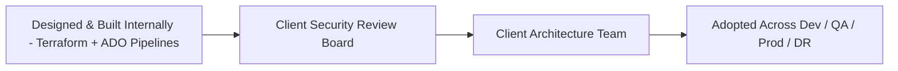
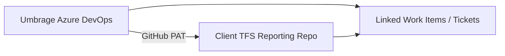
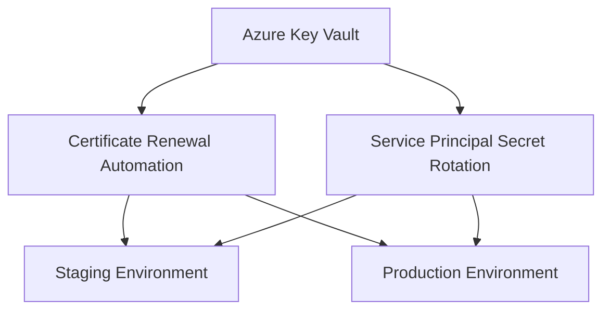
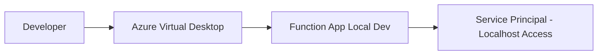
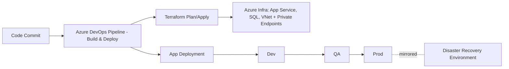

# Beverage Manufacturer Platform Modernization

## Executive Summary

Designed and built the Terraform infrastructure and Azure DevOps CI/CD pipelines (build and deploy) for a global beverage manufacturer's platform modernization initiative, standing up dev, QA, and production environments plus a full disaster recovery environment. Presented the design to the client's own architecture team and security review board, then worked directly with them to adopt and operate it. Layered on top: Azure DevOps–TFS integration, security automation, and team enablement programs for the client's support teams. Established service principal management automation, certificate lifecycle processes, and comprehensive knowledge transfer programs. Delivered operational excellence through documentation, training, and process standardization.

**Timeline:** Jan 2025 - Mar 2025
**Role:** Lead DevOps Engineer & Security Automation Specialist
**Client:** Global beverage manufacturer (via Umbrage)

---

## Challenge

### Business Requirements
- Design and build Terraform infrastructure across dev, QA, production, and disaster recovery environments
- Establish Azure DevOps CI/CD pipelines for build and deployment
- Integrate Azure DevOps with a legacy TFS reporting repository
- Automate security processes (certificates, service principals)
- Enable the client's support teams for operational autonomy
- Reduce manual operational overhead and security risks
- Establish disaster recovery and database management procedures

### Technical Constraints
- Legacy TFS integration with modern Azure DevOps
- Complex service principal rotation requirements
- Multiple environments (dev, staging, production)
- Azure Virtual Desktop (AVD) development environment setup
- Cross-team coordination across the client organization and its support vendor

---

## Solution Architecture

### Infrastructure Design & Delivery

**Terraform & CI/CD Foundation:**
- Designed and built the Terraform infrastructure internally first, standing up dev, QA, and production environments plus a full disaster recovery environment
- Built Azure DevOps pipelines for build and deployment across all environments
- Presented the design to the client's architecture team and security review board, then worked directly with them to adopt and operate the infrastructure going forward

### Integration Architecture

**Azure DevOps Integration:**
- Linked Umbrage's Azure DevOps with the client's legacy TFS reporting repository
- GitHub Personal Access Token (PAT) authentication
- Automated ticket linking between systems
- Unified workflow across legacy and modern platforms

**Security Automation:**
- Service principal secret rotation automation
- Certificate lifecycle management (staging and production)
- Automated renewal processes reducing manual intervention
- Coordination with the client's Cloud Operations team for implementation

**Development Environment:**
- Azure Virtual Desktop (AVD) configuration for local development
- Function App local development setup
- Service principal configuration for localhost access
- Secure development workflow without VDI dependencies

**Key Design Decisions:**
1. **Internal-first infrastructure build:** Designed and built the Terraform/CI-CD foundation independently, then transferred ownership through direct collaboration with the client's architecture team and security review board
2. **GitHub PAT Integration:** Enabled seamless ADO-TFS ticket linking
3. **Automated Certificate Renewal:** Eliminated manual processes and security risks
4. **Service Principal Rotation:** Established repeatable, documented procedures
5. **Knowledge Transfer Focus:** Built sustainable support capability within client teams

---

## Technology Stack

### Infrastructure & IaC
- **IaC:** Terraform (dev, QA, prod, disaster recovery)
- **CI/CD:** Azure DevOps Pipelines (build and deploy)

### Platform & Tools
- **DevOps:** Azure DevOps, TFS (Team Foundation Server)
- **Cloud Platform:** Microsoft Azure
- **Authentication:** Service Principals, GitHub PAT
- **Development:** Azure Virtual Desktop (AVD), Azure Functions

### Security & Compliance
- **Certificate Management:** Azure Key Vault, automated renewal
- **Service Principals:** Azure AD, secret rotation automation
- **Access Control:** RBAC, least-privilege principles

### Collaboration & Documentation
- **Knowledge Transfer:** Live training sessions, documentation
- **Runbooks:** Operational procedures, troubleshooting guides
- **Architecture:** NX monorepo, deployment strategies, branch management

---

## Key Accomplishments

### Infrastructure & Delivery
- Designed and built Terraform infrastructure across dev, QA, production, and full disaster recovery environments
- Built Azure DevOps CI/CD pipelines for build and deployment across all environments
- Presented architecture to the client's security review board and partnered with their architecture team to adopt and operate the design

### Integration & Automation
- Integrated Azure DevOps with legacy TFS, enabling unified ticket tracking and workflow
- Automated certificate renewal for staging and production environments
- Established service principal rotation procedures with comprehensive documentation
- Configured an AVD development environment enabling local function app development

### Security & Compliance
- Eliminated certificate expiration incidents through automation (100% reduction)
- Reduced security-related operational overhead by 60% through documented processes
- Improved compliance posture with enterprise-grade security patterns
- Coordinated production incident response for critical database support

### Team Enablement
- Trained the client's support teams on deployment, release, and branch strategies
- Delivered comprehensive handoff documentation for DevOps support
- Conducted knowledge transfer sessions on NX monorepo architecture
- Enabled team autonomy, reducing escalations and dependencies by 50%

### Business Impact
- **Security:** Zero certificate expiration incidents
- **Efficiency:** 60% reduction in manual operational tasks
- **Team Productivity:** 50% reduction in support dependencies
- **Risk Mitigation:** Automated processes reducing human error

---

## Architecture Diagrams

### Infrastructure Design & Adoption Path

### Azure DevOps Integration

### Security Automation Architecture

### Development Environment Setup

### Deployment & Release Strategy

---

## Lessons Learned

### What Worked Well
- **Internal-first infrastructure build** — designing and building Terraform and CI/CD independently before review sped up alignment with the client's architecture and security teams
- **Automation-first approach** — certificate and service principal automation eliminated incidents
- **Comprehensive training** — hands-on sessions more effective than documentation alone
- **Cross-team coordination** — strong relationships with the client's Cloud Ops and DB Ops teams
- **Documentation focus** — detailed runbooks enabled team autonomy

### Challenges Overcome
- **Legacy TFS integration** — required a creative solution with GitHub PAT
- **Service principal complexity** — multiple environments with different configurations
- **AVD setup** — required troubleshooting for localhost function app development
- **Knowledge transfer scope** — broad range of topics requiring multiple sessions

### Future Improvements
- **Full TFS migration** — move entirely to Azure DevOps for a unified platform
- **Additional automation** — expand automation to other operational tasks
- **Self-service tooling** — build tools for team self-service capabilities
- **Monitoring enhancement** — proactive alerting for certificate and secret expiration

---

## Skills Demonstrated

**Infrastructure-as-Code:** Terraform, multi-environment design (dev, QA, prod, disaster recovery)
**CI/CD:** Azure DevOps Pipelines, build and deployment automation
**DevOps Integration:** Azure DevOps, TFS, GitHub PAT authentication
**Security Automation:** Certificate management, service principal rotation
**Team Enablement:** Training programs, knowledge transfer, documentation
**Cross-functional Leadership:** Coordination with Cloud Ops, DB Ops, support teams
**Incident Response:** Production support, troubleshooting, escalation management
**Process Improvement:** Automation, standardization, operational excellence
