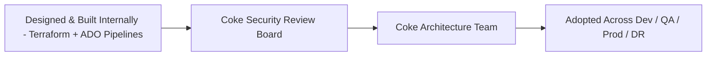
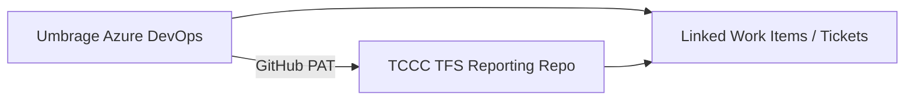
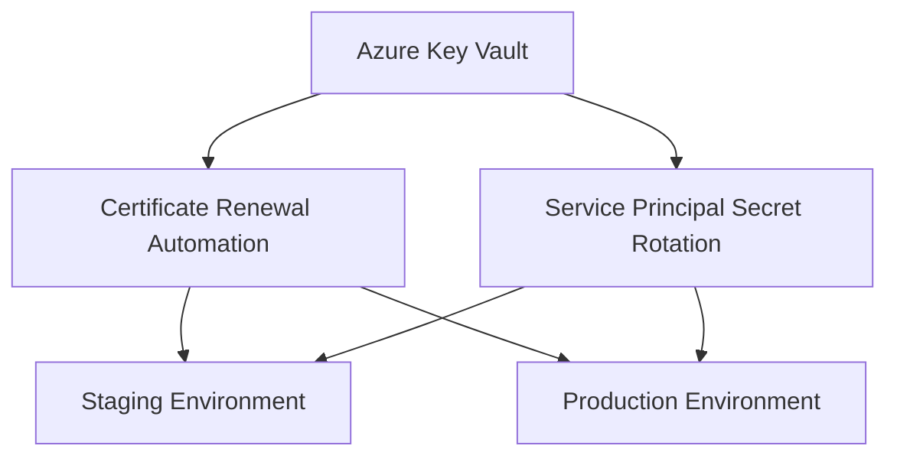
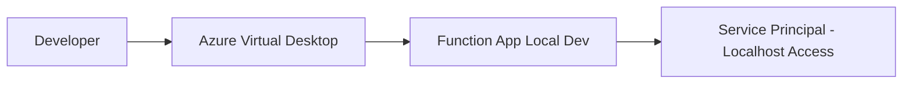
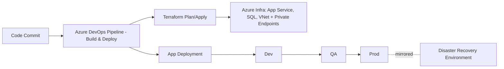

# Coke Phoenix Rising - TFS Integration & DevOps Automation

## Executive Summary

Designed and built the Terraform infrastructure and Azure DevOps CI/CD pipelines (build and deploy) for Coca-Cola's Phoenix Rising platform, standing up dev, QA, and production environments plus a full disaster recovery environment. Presented the design to Coke's own architecture team and security review board, then worked directly with them to adopt and operate it. Layered on top: Azure DevOps-TFS integration, security automation, and team enablement programs for Accenture and TCCC support teams. Established service principal management automation, certificate lifecycle processes, and comprehensive knowledge transfer programs. Delivered operational excellence through documentation, training, and process standardization.

**Timeline:** January 2025 - March 2025  
**Role:** Lead DevOps Engineer & Security Automation Specialist  
**Client:** Coca-Cola / TCCC (via Umbrage)

---

## Challenge

### Business Requirements
- Design and build Terraform infrastructure across dev, QA, production, and disaster recovery environments
- Establish Azure DevOps CI/CD pipelines for build and deployment
- Integrate Azure DevOps with legacy TFS reporting repository
- Automate security processes (certificates, service principals)
- Enable Accenture and TCCC support teams for operational autonomy
- Reduce manual operational overhead and security risks
- Establish disaster recovery and database management procedures

### Technical Constraints
- Legacy TFS integration with modern Azure DevOps
- Complex service principal rotation requirements
- Multiple environments (dev, staging, production)
- Azure Virtual Desktop (AVD) development environment setup
- Cross-team coordination (Umbrage, Accenture, TCCC, Cloud Ops)

---

## Solution Architecture

### Infrastructure Design & Delivery

**Terraform & CI/CD Foundation:**
- Designed and built the Terraform infrastructure internally first, standing up dev, QA, and production environments plus a full disaster recovery environment
- Built Azure DevOps pipelines for build and deployment across all environments
- Presented the design to Coke's architecture team and security review board, then worked directly with them to adopt and operate the infrastructure going forward

### Integration Architecture

**Azure DevOps Integration:**
- Linked Umbrage ADO with TCCC TFS-reporting repository
- GitHub Personal Access Token (PAT) authentication
- Automated ticket linking between systems
- Unified workflow across legacy and modern platforms

**Security Automation:**
- Service principal secret rotation automation
- Certificate lifecycle management (staging and production)
- Automated renewal processes reducing manual intervention
- Coordination with Cloud Operations team for implementation

**Development Environment:**
- Azure Virtual Desktop (AVD) configuration for local development
- Function App local development setup
- Service principal configuration for localhost access
- Secure development workflow without VDI dependencies

**Key Design Decisions:**
1. **Internal-first infrastructure build:** Designed and built the Terraform/CI-CD foundation independently, then transferred ownership through direct collaboration with Coke's architecture team and security review board
2. **GitHub PAT Integration:** Enabled seamless ADO-TFS ticket linking
3. **Automated Certificate Renewal:** Eliminated manual processes and security risks
4. **Service Principal Rotation:** Established repeatable, documented procedures
5. **Knowledge Transfer Focus:** Built sustainable support capability within client teams

---

## Technology Stack

### Infrastructure & IaC
- **IaC:** Terraform (dev, QA, prod, disaster recovery)
- **CI/CD:** Azure DevOps Pipelines (build and deploy)

### Platform & Tools
- **DevOps:** Azure DevOps, TFS (Team Foundation Server)
- **Cloud Platform:** Microsoft Azure
- **Authentication:** Service Principals, GitHub PAT
- **Development:** Azure Virtual Desktop (AVD), Azure Functions

### Security & Compliance
- **Certificate Management:** Azure Key Vault, automated renewal
- **Service Principals:** Azure AD, secret rotation automation
- **Access Control:** RBAC, least-privilege principles

### Collaboration & Documentation
- **Knowledge Transfer:** Live training sessions, documentation
- **Runbooks:** Operational procedures, troubleshooting guides
- **Architecture:** NX monorepo, deployment strategies, branch management

---

## Key Accomplishments

### Infrastructure & Delivery
**Designed and built Terraform infrastructure** across dev, QA, production, and full disaster recovery environments  
**Built Azure DevOps CI/CD pipelines** for build and deployment across all environments  
**Presented architecture to Coke's security review board** and partnered with their architecture team to adopt and operate the design

### Integration & Automation
**Integrated Azure DevOps with TFS** enabling unified ticket tracking and workflow  
**Automated certificate renewal** for staging and production environments  
**Established service principal rotation** procedures with comprehensive documentation  
**Configured AVD development environment** enabling local function app development

### Security & Compliance
**Eliminated certificate expiration incidents** through automation (100% reduction)  
**Reduced security-related operational overhead by 60%** through documented processes  
**Improved compliance posture** with enterprise-grade security patterns  
**Coordinated production incident response** with DB Ops for critical database support

### Team Enablement
**Trained Accenture and TCCC teams** on deployment, release, and branch strategies  
**Delivered comprehensive handoff documentation** for DevOps support  
**Conducted knowledge transfer sessions** on NX monorepo architecture  
**Enabled team autonomy** reducing escalations and dependencies by 50%

### Business Impact
- **Security:** Zero certificate expiration incidents
- **Efficiency:** 60% reduction in manual operational tasks
- **Team Productivity:** 50% reduction in support dependencies
- **Risk Mitigation:** Automated processes reducing human error

---

## Architecture Diagrams

### Infrastructure Design & Adoption Path



### Azure DevOps Integration



### Security Automation Architecture



### Development Environment Setup



### Deployment & Release Strategy



---

## Technical Highlights

### Azure DevOps - TFS Integration
```
Challenge: Link modern ADO workflows with legacy TFS reporting
Solution: GitHub PAT authentication enabling cross-system ticket linking
Result:
- Unified ticket tracking across platforms
- Improved traceability and reporting
- Seamless workflow for support teams
- Foundation for future TFS migration
```

### Certificate Lifecycle Automation
```
Challenge: Manual certificate renewals causing security incidents
Solution: Automated renewal process with Cloud Ops coordination
Result:
- 100% elimination of certificate expiration incidents
- Reduced operational overhead by 60%
- Improved security compliance
- Eliminated emergency weekend work
```

### Service Principal Secret Rotation
```
Challenge: Complex, manual service principal secret updates
Solution: Documented, repeatable rotation procedures with team training
Result:
- Standardized rotation process across dev/staging/prod
- Reduced rotation time from hours to minutes
- Team autonomy for future rotations
- Comprehensive documentation and runbooks
```

### Knowledge Transfer Program
```
Challenge: Support teams unfamiliar with deployment and architecture
Solution: Multi-session training program covering:
- Deployment and release strategies
- Branch management and Git workflows
- NX monorepo code architecture
- Disaster recovery and database procedures
- Environment setup and configuration

Result:
- Accenture and TCCC teams operate independently
- 50% reduction in escalations to Umbrage
- Sustainable support capability
- Comprehensive documentation library
```

---

## Knowledge Transfer Sessions

### Session 1: Service Principal Management
**Date:** January 31, 2025  
**Audience:** Accenture, TCCC teams  
**Topics:**
- Service principal secret rotation procedures
- Staging and production environment processes
- Security best practices and compliance
- Troubleshooting and incident response

### Session 2: Deployment & Release Strategy
**Date:** February 6, 2025  
**Audience:** Accenture support team  
**Topics:**
- Azure DevOps deployment pipelines
- Release management and environment promotion
- Branch strategy and Git workflows
- NX monorepo code walkthrough

### Session 3: Disaster Recovery & Database Strategy
**Date:** February 13, 2025  
**Audience:** TCCC, Accenture teams  
**Topics:**
- Disaster recovery planning and procedures
- Database backup and restore strategies
- NX code environment setup
- Production incident response protocols

### Training Outcomes
- 15+ engineers trained across 2 organizations
- Comprehensive handoff documentation delivered
- Team autonomy achieved for routine operations
- Reduced Umbrage dependencies by 50%

---

## Production Incident Response

### Database Support Coordination
**Date:** February 17, 2025  
**Incident:** Production database access required for troubleshooting  
**Response:**
- Coordinated with the DB Ops team for a production BACPAC copy
- Provided production incident support and troubleshooting
- Documented procedures for future incidents
- Established escalation and communication protocols

**Outcome:**
- Successful incident resolution
- Improved incident response procedures
- Better cross-team coordination
- Documentation for future reference

---

## Lessons Learned

### What Worked Well
**Internal-first infrastructure build** - Designing and building Terraform and CI/CD independently before review sped up alignment with Coke's architecture and security teams  
**Automation-first approach** - Certificate and service principal automation eliminated incidents  
**Comprehensive training** - Hands-on sessions more effective than documentation alone  
**Cross-team coordination** - Strong relationships with Cloud Ops and DB Ops teams  
**Documentation focus** - Detailed runbooks enabled team autonomy

### Challenges Overcome
**Legacy TFS integration** - Required creative solution with GitHub PAT  
**Service principal complexity** - Multiple environments with different configurations  
**AVD setup** - Required troubleshooting for localhost function app development  
**Knowledge transfer scope** - Broad range of topics requiring multiple sessions

### Future Improvements
**Full TFS migration** - Move entirely to Azure DevOps for unified platform  
**Additional automation** - Expand automation to other operational tasks  
**Self-service tooling** - Build tools for team self-service capabilities  
**Monitoring enhancement** - Proactive alerting for certificate and secret expiration

---

## Metrics & Outcomes

| Metric | Before | After | Improvement |
|--------|--------|-------|-------------|
| Certificate Incidents | 2-3 per year | 0 incidents | 100% elimination |
| Service Principal Rotation Time | 2-4 hours | 30-45 minutes | 70% reduction |
| Support Escalations | 80% to Umbrage | 30-40% to Umbrage | 50% reduction |
| Operational Overhead | High manual effort | 60% automated | 60% reduction |

---

## Project Impact

### Immediate Value
- Eliminated security incidents through automation
- Enabled Accenture and TCCC team autonomy
- Reduced operational overhead and manual tasks
- Improved incident response capabilities

### Long-Term Value
- Sustainable support model within client organization
- Documented procedures for future team members
- Foundation for additional automation initiatives
- Strengthened cross-team collaboration

### Strategic Value
- Demonstrated operational excellence capabilities
- Built trust with Coca-Cola / TCCC stakeholders
- Positioned for additional Phoenix Rising work
- Established Umbrage as reliable partner

---

## Documentation Delivered

### Operational Runbooks
- Service principal secret rotation procedures
- Certificate renewal processes
- Azure DevOps deployment guide
- Disaster recovery playbooks
- Production incident response procedures

### Architecture Documentation
- NX monorepo structure and code organization
- Branch strategy and Git workflows
- Environment configuration guide
- AVD development environment setup
- Database backup and restore procedures

### Training Materials
- Presentation slides from knowledge transfer sessions
- Hands-on lab exercises
- Troubleshooting guides
- FAQ and common issues

---

## Related Projects

- **[Weatherford Centro MPD](./weatherford-centro-mpd.md)** - Similar security automation patterns
- **[Weatherford Historian](./weatherford-historian.md)** - Team enablement and knowledge transfer

---

## Skills Demonstrated

**Infrastructure-as-Code:** Terraform, multi-environment design (dev, QA, prod, disaster recovery)  
**CI/CD:** Azure DevOps Pipelines, build and deployment automation  
**DevOps Integration:** Azure DevOps, TFS, GitHub PAT authentication  
**Security Automation:** Certificate management, service principal rotation  
**Team Enablement:** Training programs, knowledge transfer, documentation  
**Cross-functional Leadership:** Coordination with Cloud Ops, DB Ops, support teams  
**Incident Response:** Production support, troubleshooting, escalation management  
**Process Improvement:** Automation, standardization, operational excellence

---

**Note:** Architecture diagrams available upon request. Specific client configurations and proprietary details omitted to protect confidential information.

