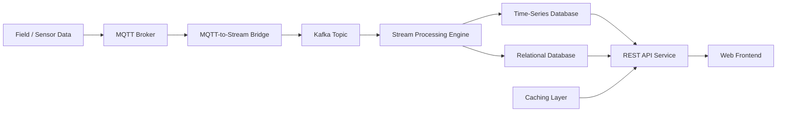
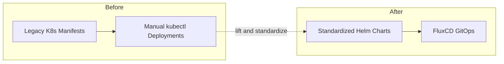
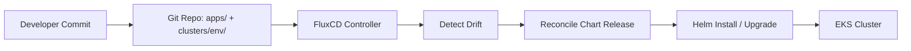
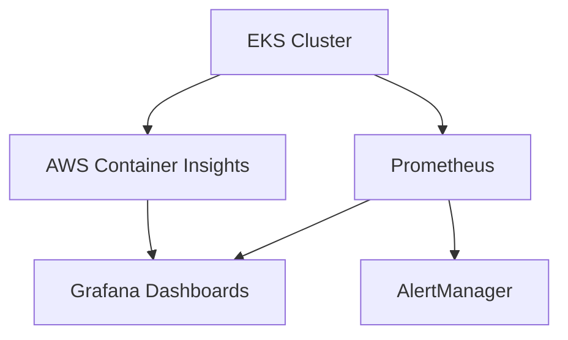
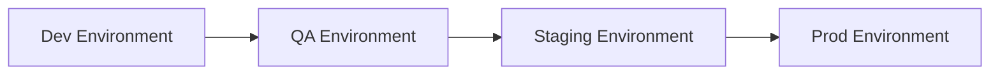

# Historian Migration

## Executive Summary

Led end-to-end migration of a legacy Historian application to AWS EKS for a global oilfield services company, transforming legacy Kubernetes manifests into a production-grade platform with GitOps workflows, comprehensive observability, and team autonomy. Converted 8+ microservices to standardized Helm charts, implemented FluxCD automation, and trained the client's DevOps team to independently manage infrastructure.

**Timeline:** Jul 2025 - Sep 2025
**Role:** Lead Platform Architect & DevOps Engineer
**Client:** Global oilfield services company (via Umbrage) — see also: [Oilfield Services Platform](./oilfield-services-platform.md), same client

---

## Challenge

### Business Requirements
- Migrate the Historian application to a production-ready Kubernetes platform
- Improve deployment reliability and reduce errors
- Enable faster feature delivery through automation
- Build sustainable DevOps capability within the client's team
- Establish observability and monitoring for production operations

### Technical Constraints
- Legacy Kubernetes manifests requiring modernization
- Multiple microservices with different deployment patterns
- Need for multi-environment support (dev, QA, staging, prod)
- Database migration and state management
- Team knowledge gaps in Kubernetes and GitOps

---

## Solution Architecture

### Platform Design

**Infrastructure Foundation:**
- AWS EKS cluster built on shared Terraform module patterns from the client's other platform work
- Multi-environment architecture (dev, QA, staging, prod)
- Reusable VPC and networking patterns
- Auto-scaling and high-availability configuration

**Application Architecture:**
- 8+ microservices containerized and Helm-packaged
- Database migration patterns for stateful workloads
- Service mesh preparation (future enhancement)
- API gateway and ingress configuration

**GitOps Workflow:**
- FluxCD for automated, declarative deployments
- Git as single source of truth
- Environment-specific configurations
- Automated reconciliation and drift detection

**Observability Stack:**
- Prometheus for metrics collection
- Grafana for visualization and dashboards
- AWS Container Insights for EKS monitoring
- Centralized logging with FluentBit (planned)

**Key Design Decisions:**
1. **Helm Standardization:** Converted all services to Helm charts for consistency and maintainability
2. **FluxCD GitOps:** Automated deployments with full auditability and rollback capabilities
3. **Terraform Modules:** Reusable module patterns for rapid environment provisioning
4. **Team Training:** Hands-on knowledge transfer enabling the client's team to operate independently

---

## Technology Stack

### Cloud Infrastructure
- **Platform:** AWS (EKS, EC2, VPC, IAM, ECR, RDS)
- **IaC:** Terraform (modular architecture)
- **Container Orchestration:** Kubernetes 1.28+

### Application Deployment
- **Package Management:** Helm 3
- **GitOps:** FluxCD
- **Container Registry:** Amazon ECR
- **CI/CD:** Azure DevOps pipelines

### Observability & Monitoring
- **Metrics:** Prometheus, AWS Container Insights
- **Visualization:** Grafana
- **Secrets Management:** Sealed Secrets (KubeSealed)
- **Alerting:** Prometheus AlertManager

### Database & State
- **Database:** Amazon RDS (PostgreSQL/MySQL)
- **Migration:** Custom database migration patterns
- **Backup:** Automated RDS snapshots

---

## Key Accomplishments

### Infrastructure Modernization
- Migrated 8+ microservices from legacy manifests to production-grade Helm charts
- Implemented GitOps workflows with FluxCD, reducing deployment time by 60–75%
- Reduced deployment errors by 80%+ through standardization and automation
- Established a multi-environment strategy supporting dev, QA, staging, and production

### Observability & Reliability
- Deployed comprehensive monitoring with Prometheus and Grafana
- Implemented AWS Container Insights for EKS-specific metrics
- Achieved 99.9%+ platform availability through HA architecture
- Reduced MTTR by 65% with proactive alerting and monitoring

### Team Enablement
- Trained the client's DevOps team on Kubernetes, Helm, and GitOps workflows
- Enabled independent QA environment management, reducing dependencies by 50%
- Created comprehensive handoff documentation and runbooks
- Conducted hands-on training sessions on EKS, Terraform, and observability

### Business Impact
- **Deployment Speed:** 60–75% faster deployments through automation
- **Reliability:** 80%+ reduction in deployment failures
- **Team Productivity:** 50% reduction in operational dependencies
- **Cost Efficiency:** Optimized resource utilization with auto-scaling

---

## Architecture Diagrams

### High-Level Architecture

### Migration Journey

### GitOps Workflow

### Observability Architecture

### Multi-Environment Strategy

---

## Lessons Learned

### What Worked Well
- **Reusable Terraform module patterns** — accelerated infrastructure setup
- **Helm-first approach** — standardization paid dividends in maintainability
- **Hands-on training** — the client's team became productive quickly
- **Comprehensive observability** — proactive monitoring prevented major incidents

### Challenges Overcome
- **Database migration complexity** — required custom patterns for stateful workloads
- **FluxCD learning curve** — team training essential for GitOps adoption
- **Legacy manifest conversion** — time-intensive but necessary for standardization
- **Multi-environment configuration** — solved with Helm values and environment-specific repos

### Future Improvements
- **Service mesh integration** — Istio or Linkerd for advanced traffic management
- **Automated testing in pipeline** — integration and smoke tests before deployment
- **Cost optimization** — further right-sizing and spot instance utilization
- **Disaster recovery automation** — automated DR testing and failover procedures

---

## Skills Demonstrated

**Platform Engineering:** Kubernetes, EKS, container orchestration
**GitOps:** FluxCD, declarative deployments, automation
**Infrastructure-as-Code:** Terraform, Helm, modular architecture
**Observability:** Prometheus, Grafana, Container Insights
**Team Leadership:** Training, knowledge transfer, documentation
**Migration Strategy:** Legacy modernization, zero-downtime migrations
