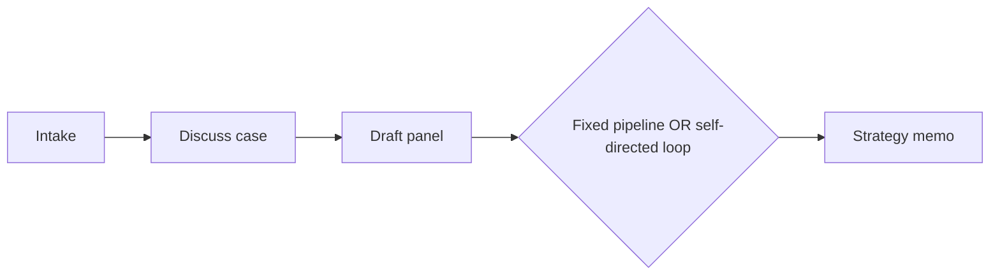

# Counsel AI

## Overview

A case-strategy workspace for attorneys — intake a case, discuss it with an LLM, draft revisable letters and outlines, and generate a strategy memo through either a fixed pipeline or a self-directed loop where the model chooses among a small set of analysis steps and decides when to stop.

**Timeline:** May 2026 &middot; **Role:** Independent project
**Stack:** Next.js/React, Supabase, 5 LLM providers, in-browser WebGPU inference

---

## The Problem

Explored what a genuinely useful LLM-assisted legal tool looks like structurally — intake, drafting, and strategy synthesis as real distinct steps, not a chatbot bolted onto a document store — while being explicit about which pieces are real and which are deliberately scaffolded for later. Legal-database retrieval (CourtListener, Lexis/Westlaw-class APIs) typically requires commercial agreements this project doesn't have; rather than fake it, the interface for it exists and returns nothing, honestly, until real access is in place.

## Architecture

**Five LLM providers behind one interface, not three.** Gemini, Groq, OpenAI, Anthropic, and Ollama — with everything except Gemini hand-written against each provider's raw streaming protocol (two different SSE wire formats, one NDJSON format) rather than pulled in as SDKs, all normalized behind a single stream interface.

**Every core feature has a server path and a fully in-browser path.** Chat, draft revision, and the strategy pipeline all run either through server-side API calls or entirely client-side via WebGPU inference (WebLLM) — letting a user choose zero-server-cost local inference over an API call for the same task.

**A self-directed loop, honestly scoped.** The strategy-memo agent picks among three named analysis stages and decides when to finish, with real defensive handling: a regex-based salvage parser recovers from malformed JSON output, and if the loop runs out its step budget without finishing, it forces a fallback synthesis so the user still gets a memo rather than an error. The "tools" the loop calls are different prompts dispatched to the same model, not external functions with side effects — genuine LLM-driven control flow, not autonomous tool execution, and worth being precise about that distinction.

**Retrieval scaffolded, not faked.** The RAG and legal-research interfaces are real, clean, swappable code — they just return nothing today. That's a deliberate choice over mocking a fake result that would look more impressive and be less honest.

## Technology Stack

| Layer | Tools |
|---|---|
| Frontend | Next.js, React, Tailwind |
| Auth/data | Supabase (Postgres + row-level security) |
| LLM providers | Gemini (SDK), Groq/OpenAI/Anthropic/Ollama (hand-rolled streaming clients) |
| In-browser inference | WebLLM (WebGPU) |
| Deployment | Vercel |

## Notable Engineering Decisions

- Hand-rolled streaming parsers for three different wire formats, unified behind one interface, instead of depending on four separate provider SDKs
- Recognized that small in-browser models can't reliably hold to a strict JSON contract and shipped an explicit, documented fallback to a simpler fixed pipeline for that path, rather than papering over the failure mode
- Kept the retrieval layer as an honest empty interface rather than mocking a result that isn't real

## Status

Deployed and reachable on Vercel with working Supabase auth. The smallest and least mature of my independent projects — no automated test suite yet — and the most honest about the gap between "designed" and "implemented" for its most ambitious feature.
