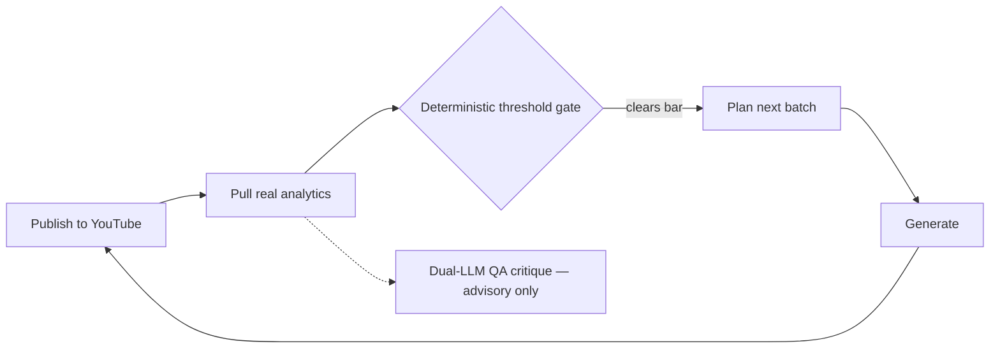

# Living Ambient Engine

## Overview

A closed-loop generative media pipeline — procedurally generates ambient audiovisual content (fractal and procedural visuals paired with sample-accurate binaural and solfeggio audio across 39 mood presets), publishes it to two YouTube channels, then uses the resulting real analytics to decide what to make next. Includes an experimental dual-model QA layer that reviews each week's results using a cloud LLM and a locally-run quantized model in parallel — as an observer, not a decision-maker.

**Timeline:** Jan–May 2026 &middot; **Role:** Independent project
**Stack:** Python (NumPy, Numba), GitHub Actions, YouTube Data/Analytics API, Gemini API, local GGUF inference

---

## The Problem

Wanted to build a genuinely closed-loop content pipeline — one where the path from "what performed" to "what to make next" runs without a human in it — while staying disciplined about where AI is allowed to have influence and where deterministic logic makes the actual call. It's easy to build a pipeline that *claims* to be data-driven; the harder problem is making the go/no-go decision auditable and making sure an unreliable component (a small local model) can't quietly corrupt it.

## Architecture

**Entirely run as scheduled and triggered GitHub Actions jobs, not a hosted server.** Analytics pulls, the planning gate, generation, and uploads are all versioned workflow runs — cron-scheduled or chained via `workflow_run` — rather than a persistent process. Nothing costs anything while idle, and because every step only exists as code in a workflow file, the pipeline can't drift into a manually-patched state the way a long-running server can.

**A deterministic, fail-closed planning gate is what actually decides what gets made.** Real YouTube Analytics are bucketed by mood and compared against a rolling baseline; a mood only gets flagged as worth making more of once it clears a minimum sample size and view threshold. If nothing clears the bar, the pipeline blocks outright — and CI is wired so a blocked week can't silently fall through to generation anyway. This is the actual brain of the system: intentionally simple, auditable arithmetic, not a model's judgment call.

**An experimental dual-LLM layer sits alongside it, strictly as an observer.** Each week, a cloud model (Gemini) and a small locally-run quantized model run in parallel — the cloud model gets the full context, the local model gets a deliberately leaner bundle sized to fit its much smaller context window. Both narrate and critique the same analytics independently; neither can trigger generation or uploads. Every output is stamped advisory-only, and the local model's claims about specific numbers are checked against ground truth and corrected in code — rather than trusted — if it gets them wrong.

**Real generation, not placeholder content.** Visuals use the correct escape-time fractal math with smooth continuous coloring, JIT-compiled with Numba for per-pixel performance, alongside a broader set of procedural (non-fractal) patterns. Audio is sample-accurate DSP: correct binaural-beat stereo technique mapped to real brainwave bands, named solfeggio tones, proper ADSR envelopes, a multi-tap comb-filter reverb, and vectorized pink noise — not sampled loops.

## Technology Stack

| Layer | Tools |
|---|---|
| Generation | Python, NumPy, Numba (JIT), Pillow/OpenCV, FFmpeg |
| Publishing & analytics | YouTube Data API v3, YouTube Analytics API v2 |
| QA/advisory layer | Gemini API (raw REST, no SDK), llama-cpp-python (local quantized GGUF, CPU) |
| Orchestration | GitHub Actions (scheduled + chained workflows) |
| Testing | pytest |

## Notable Engineering Decisions

- Kept the actual publish/don't-publish decision deterministic and auditable, using AI strictly as a QA/observability layer on top of it rather than letting a model decide what ships
- Built specific defenses around the local model's known failure modes: verifying its claims against ground-truth numbers and injecting the correct figures in code if it can't reproduce them, plus detecting and stripping a small model's tendency toward tautological comparisons ("X is slightly higher than X")
- Fail-closed CI: a week with no actionable analytics signal blocks the pipeline entirely rather than falling back to a default batch

## Status

571 commits over roughly 4 months — the largest and most tested of my independent projects, with 140+ automated tests covering the QA-layer guardrails, config validation, and audio/visual generation contracts. Running on two live YouTube channels against real, if still early-stage, production analytics.
