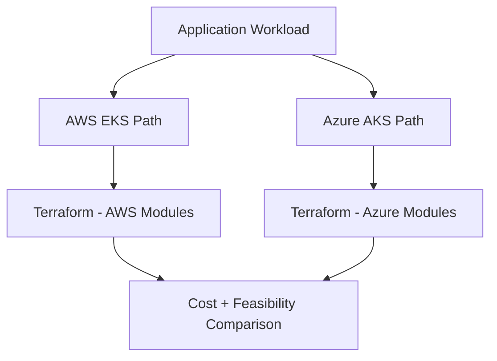
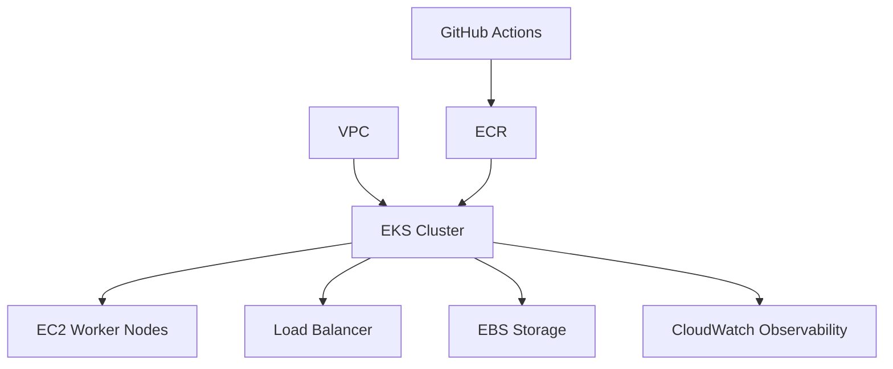
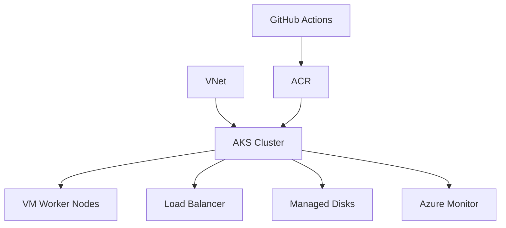
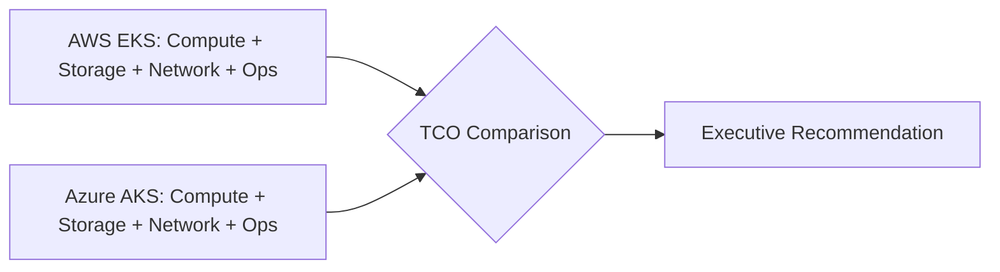
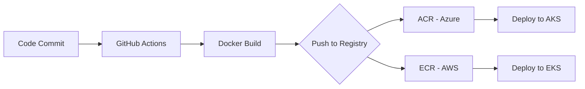

# Major U.S. Airline — Platform Architecture

## Executive Summary

Designed multi-cloud platform architecture and delivered comprehensive cost analysis for a major U.S. airline's technical review sessions. Created architecture diagrams, infrastructure cost estimates, and technical presentations demonstrating platform strategy across AWS and Azure. Built proof-of-concept implementations on both Azure AKS and AWS EKS to validate the multi-cloud approach.

**Timeline:** Apr 2025 - Jun 2025
**Role:** Cloud Platform Architect & Technical Advisor
**Client:** Major U.S. airline (via Umbrage)

---

## Challenge

### Business Requirements
- Evaluate cloud platform options for application modernization
- Provide data-driven infrastructure cost analysis for executive decision-making
- Design a scalable, multi-cloud architecture strategy
- Demonstrate technical feasibility through proof-of-concept implementations
- Present architecture recommendations to technical stakeholders

### Technical Constraints
- Multi-cloud consideration (AWS and Azure)
- Integration with existing client infrastructure
- Cost optimization and budget constraints
- Scalability and high-availability requirements
- Compliance and security standards

---

## Solution Architecture

### Architecture Design Approach

**Multi-Cloud Strategy:**
- Evaluated AWS EKS and Azure AKS for container orchestration
- Designed cloud-agnostic deployment patterns
- Assessed vendor lock-in risks and mitigation strategies
- Compared cost, performance, and operational characteristics

**Platform Components:**
- Kubernetes-based container orchestration (EKS/AKS)
- Infrastructure-as-Code with Terraform
- CI/CD pipeline architecture (GitHub Actions, Azure DevOps)
- Observability and monitoring strategy
- Security and compliance framework

**Proof-of-Concept Implementations:**
1. **Azure AKS:** Full-stack pilot — FastAPI backend + React frontend, both deployed via GitHub Actions CI/CD
2. **AWS EKS:** Terraform Cloud integration and deployment automation
3. **Cost Analysis:** Detailed infrastructure cost estimates for both platforms

**Key Design Decisions:**
1. **Multi-cloud evaluation:** Provided an objective comparison enabling informed decision-making
2. **Cost transparency:** Detailed TCO analysis including compute, storage, networking, and operational costs
3. **PoC validation:** Hands-on implementations demonstrating technical feasibility
4. **Architecture diagrams:** Visual representations for stakeholder communication

---

## Technology Stack

### Cloud Platforms Evaluated
- **AWS:** EKS, EC2, VPC, RDS, S3, CloudWatch
- **Azure:** AKS, VMs, VNet, Azure SQL, Blob Storage, Monitor

### Infrastructure & Automation
- **IaC:** Terraform, Terraform Cloud
- **Container Orchestration:** Kubernetes (EKS/AKS)
- **CI/CD:** GitHub Actions, Azure DevOps
- **Container Registry:** ECR (AWS), ACR (Azure)

### Application Stack (PoC)
- **Backend:** FastAPI (Python)
- **Frontend:** React
- **Containerization:** Docker
- **Deployment:** Kubernetes manifests, Helm (planned)

### Cost Analysis Tools
- **AWS:** Cost Explorer, Pricing Calculator
- **Azure:** Cost Management, Pricing Calculator
- **Comparison:** Custom TCO analysis spreadsheets

---

## Key Accomplishments

### Architecture & Design
- Created comprehensive architecture diagrams for multi-cloud platform strategy
- Delivered detailed cost estimates comparing AWS and Azure implementations
- Designed scalable, cloud-agnostic patterns reducing vendor lock-in risk
- Presented technical reviews to client stakeholders and knowledge holders

### Proof-of-Concept Implementations
- Built a full-stack pilot (FastAPI + React) on Azure AKS with GitHub Actions CI/CD
- Deployed AWS EKS with Terraform Cloud, demonstrating infrastructure automation
- Validated multi-cloud feasibility through hands-on implementations
- Documented deployment patterns for both cloud platforms

### Business Impact
- **Informed Decision-Making:** Data-driven cost analysis for executive review
- **Risk Mitigation:** Multi-cloud strategy reducing vendor dependency
- **Technical Validation:** PoC implementations proving feasibility
- **Knowledge Transfer:** Architecture documentation for the client's team

---

## Architecture Diagrams

### Multi-Cloud Architecture Overview

### AWS EKS Architecture

### Azure AKS Architecture

### Cost Comparison Analysis

### CI/CD Pipeline Architecture

---

## Lessons Learned

### What Worked Well
- **Multi-cloud PoC approach** — hands-on validation more valuable than theoretical analysis
- **Visual architecture diagrams** — effective communication tool for stakeholders
- **Detailed cost analysis** — enabled data-driven decision-making
- **Technical presentations** — built credibility and trust with the client's team

### Challenges Overcome
- **Cloud platform differences** — required deep understanding of both AWS and Azure
- **Cost estimation complexity** — many variables affecting TCO calculations
- **Stakeholder alignment** — multiple teams with different priorities and preferences

### Insights Gained
- **Multi-cloud trade-offs** — no single "best" platform, it depends on requirements
- **Cost optimization opportunities** — significant savings possible with right-sizing and reserved instances
- **Importance of PoC** — hands-on validation builds confidence in recommendations
- **Communication is key** — technical depth plus clear presentation makes for a successful engagement

---

## Skills Demonstrated

**Cloud Architecture:** Multi-cloud design (AWS, Azure), platform strategy
**Cost Analysis:** TCO calculation, FinOps, budget planning
**Technical Presentations:** Stakeholder communication, architecture reviews
**Proof-of-Concept:** Hands-on validation, rapid prototyping
**Infrastructure-as-Code:** Terraform, Terraform Cloud, automation
**CI/CD:** GitHub Actions, Azure DevOps, pipeline design
