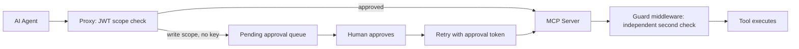

# MCPToolGuard

## Overview

A policy-enforcement proxy that sits between AI agents and MCP (Model Context Protocol) tool servers, enforcing JWT scope-based authorization so an agent holding a read-only token can never execute a write-scoped tool — even if it tries. Tested against real, unowned third-party MCP servers (GitHub Copilot MCP, Slack), not just an owned mock.

**Timeline:** May–Jul 2026 (ongoing) &middot; **Role:** Independent project
**Stack:** TypeScript/Node, Python, Auth0, Kubernetes (Helm), OpenTelemetry

---

## The Problem

As AI agents get direct tool access to real systems, the trust boundary between "agent" and "irreversible action" needs real enforcement, not prompt-level instruction. This project treats an agent's tool call the way a network firewall treats a packet: verify the token, check the policy, log everything, and route anything risky to a human — enforced independently on both sides of the wire, not just at one choke point.

## Architecture

**Belt-and-suspenders enforcement.** A TypeScript proxy validates JWT scope on the agent-facing side before forwarding a call. An independent Python ASGI middleware re-validates the same JWT and re-checks the same scope inside the MCP server itself. Bypassing the proxy and hitting the server directly still gets denied — each side is independently auditable and neither trusts the other's decision.

**Dual-trust JWT verification** — Auth0 JWKS when configured, PEM fallback otherwise — with wildcard scope matching (`resource:*`, global `*`) and live M2M revocation: deleting an agent's record invalidates its already-issued tokens immediately, not just at their natural expiry.

**Human-in-the-loop for risky calls.** A write-scoped request without the right key doesn't just fail — it's queued. An operator approves it in a UI, a one-time approval token is minted, and only then does the retried call proceed.

**CI that enforces its own security invariant.** A dedicated check fails the build if the client-side and server-side policy configs drift apart from each other, so the two enforcement points can't silently fall out of sync.

**Verified in production, not just demoed.** An agent holding only `repo:read` scope attempted a write against the real GitHub Copilot MCP. It was denied, queued for approval, approved by a human through the UI, retried with a one-time token, and completed — producing a real, externally verifiable commit in a live repository. That's an end-to-end authorization flow with a checkable artifact at the end of it, not a mocked walkthrough.

**A full ephemeral Kubernetes environment, built and torn down per pull request.** Rather than maintaining a persistent staging cluster, CI builds three Docker images (gateway, UI, KV-REST adapter), spins up a k3d cluster from scratch, creates a real but temporary Auth0 M2M client scoped to `gateway:admin` via the Auth0 Management API, deploys the full Helm chart into it, waits on rollout with a failure trap that dumps every pod's logs, runs a real smoke test against the live ephemeral endpoints — then deletes both the k3d cluster and the Auth0 client/grant it created, success or failure. Same philosophy as the rest of the project's infra choices: nothing persists unless it's actively needed, and since the whole environment is rebuilt from scratch every run, it can't silently drift from what the Helm chart actually describes.

## Technology Stack

| Layer | Tools |
|---|---|
| Proxy / gateway | TypeScript, Node 22, `jose` (JWT/JWKS) |
| Mock MCP server | Python, FastMCP (ASGI) |
| Identity | Auth0 (JWKS + M2M client-credentials) |
| Observability | OpenTelemetry, Grafana dashboards-as-code |
| Deployment | Docker, Helm, k3d (ephemeral per-PR Kubernetes), Render, Vercel |

## Notable Engineering Decisions

- Independent client-side and server-side enforcement, so a compromised or bypassed proxy alone doesn't compromise the system
- CI spins up a full disposable Kubernetes cluster per pull request — including a real, temporary Auth0 client created and torn down via the Auth0 Management API — to test the Helm deployment path end-to-end
- A dedicated, read-only review process whose entire job is distinguishing *authoritative* enforcement (server-side — a miss here is a real vulnerability) from *advisory* client-side pre-checks, treating security review itself as an engineering artifact rather than an afterthought

## Status

442 commits over roughly 8 weeks, 4 versioned releases, real integration tests that spawn the actual built server and sign real JWTs rather than mocking the auth layer, live across two production hosts (Render + Vercel).
