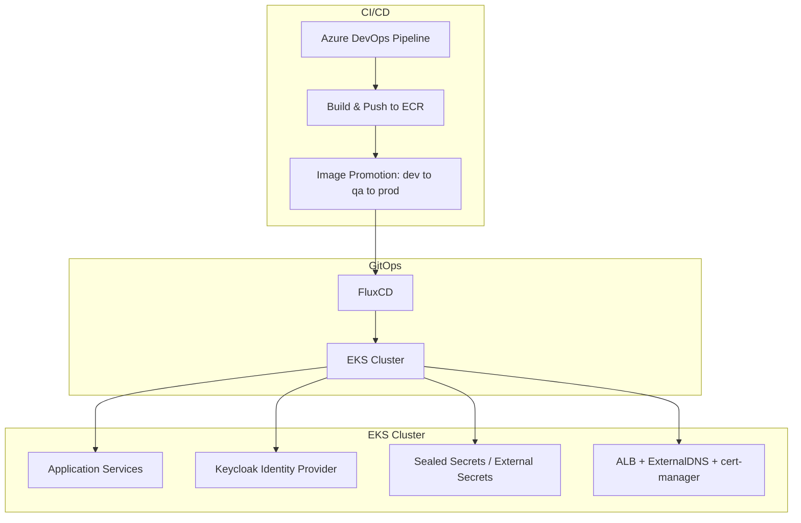
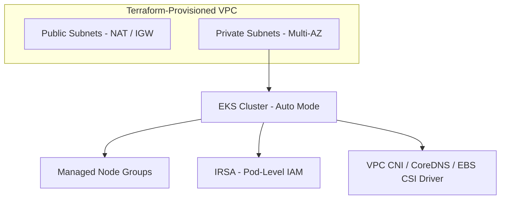
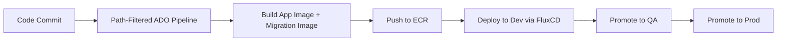
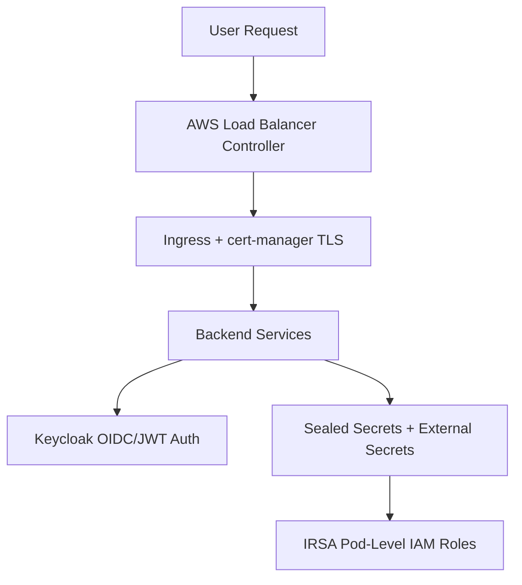

# Oilfield Services Platform

## Executive Summary

Architected and delivered a production-grade AWS EKS platform for a global oilfield services company's drilling-operations application, using reusable Terraform modules and modern DevOps practices. Established scalable infrastructure-as-code patterns, implemented enterprise-grade security with Keycloak authentication, and created CI/CD pipelines that reduced deployment time and standardized release processes.

**Timeline:** Nov 2025 - Dec 2025
**Role:** Lead Platform Architect & DevOps Engineer
**Client:** Global oilfield services company (via Umbrage)

---

## Challenge

### Business Requirements
- Deploy the application on cloud-native infrastructure
- Support multiple environments (dev, staging, production)
- Implement secure authentication and authorization
- Enable rapid, reliable deployments
- Establish patterns for future platform projects

### Technical Constraints
- Need for reusable infrastructure components
- Enterprise security and compliance requirements
- Integration with existing Azure DevOps workflows
- Secrets management for sensitive configurations
- Support for engineering team without VDI access

---

## Solution Architecture

### Platform Design

**Infrastructure Foundation:**
- AWS EKS cluster with custom VPC configuration
- Modular Terraform approach for environment replication
- Multi-AZ deployment for high availability
- Auto-scaling node groups for cost optimization

**Security Architecture:**
- Keycloak for authentication and identity management
- Sealed Secrets for Kubernetes secrets encryption
- IAM roles and RBAC for fine-grained access control
- Service principal management automation

**CI/CD Pipeline:**
- Azure DevOps integration with custom ADO agent module
- Docker build and push to ECR
- Automated deployment to EKS
- Environment-specific configuration management

**Key Design Decisions:**
1. **Terraform Modules:** Created reusable modules for EKS, VPC, and supporting infrastructure — enabling rapid environment provisioning
2. **Keycloak Integration:** Centralized authentication strategy supporting multi-tenant access patterns
3. **Sealed Secrets:** GitOps-friendly secrets management allowing secure storage in version control
4. **ADO Agent Module:** Custom module enabling CI/CD integration without VDI dependencies

---

## Technology Stack

### Cloud Infrastructure
- **Platform:** AWS (EKS, EC2, VPC, IAM, ECR)
- **IaC:** Terraform (modular architecture)
- **Container Orchestration:** Kubernetes 1.28+

### Security & Authentication
- **Identity Management:** Keycloak
- **Secrets Management:** Sealed Secrets (Bitnami)
- **Access Control:** AWS IAM, Kubernetes RBAC

### CI/CD & Automation
- **Pipeline:** Azure DevOps (image build/push), FluxCD (GitOps deployment)
- **Container Registry:** Amazon ECR
- **Deployment:** Kubernetes manifests, Helm charts via FluxCD/Kustomize overlays per environment

### Observability
- **Monitoring:** Prometheus, Grafana
- **Logging:** CloudWatch, FluentBit
- **Alerting:** AlertManager

---

## Key Accomplishments

### Infrastructure Efficiency
- Reduced provisioning time from weeks to hours through a modular Terraform approach
- Established reusable patterns adopted for subsequent projects
- Enabled self-service environment creation through documented modules

### Security & Compliance
- Implemented enterprise-grade authentication with Keycloak multi-tenant support
- Secured secrets management using Sealed Secrets for GitOps workflows
- Established IAM best practices with least-privilege access patterns

### Team Enablement
- Created comprehensive documentation for infrastructure patterns and deployment processes
- Enabled the engineering team to work without VDI through cloud-native tooling
- Built an ADO agent module standardizing CI/CD integration across projects

### Business Impact
- **Time Savings:** 85%+ reduction in environment provisioning time
- **Cost Efficiency:** Right-sized infrastructure with auto-scaling capabilities
- **Scalability:** Patterns reused across multiple projects for this client
- **Security:** Zero security incidents, compliance-ready architecture

---

## Architecture Diagrams

### High-Level Architecture

### Infrastructure Components

### CI/CD Pipeline Flow

### Security Architecture

---

## Lessons Learned

### What Worked Well
- **Modular Terraform approach** — massive time savings and reusability across projects
- **Early Keycloak integration** — established an authentication pattern for future services
- **Documentation-first mindset** — enabled team autonomy and knowledge transfer
- **Helm + FluxCD GitOps** — standardized deployments via Kustomize/Helm overlays per environment, reconciled automatically from Git rather than pushed by the pipeline

### Challenges Overcome
- **ADO agent configuration** — required a custom module for EKS integration
- **Sealed Secrets learning curve** — team training needed for the GitOps workflow
- **VDI limitations** — solved with a cloud-native development environment

### Future Improvements
- **Enhance observability** — deepen the existing Prometheus/Grafana monitoring stack with more service-level dashboards and alerting coverage

---

## Skills Demonstrated

**Cloud Architecture:** AWS EKS, VPC design, multi-AZ deployment
**Infrastructure-as-Code:** Terraform modules, reusable patterns
**Security:** Keycloak, Sealed Secrets, IAM, RBAC
**CI/CD:** Azure DevOps, Docker, ECR integration
**Platform Engineering:** Kubernetes, container orchestration
**Documentation:** Technical writing, knowledge transfer
