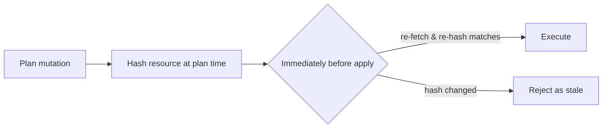

# Pangnosis

## Overview

A cloud infrastructure visibility platform built on an "API-as-truth" premise — instead of trusting a Terraform-style state file that can silently drift from reality, always discover and diff against the live cloud API. Resources are modeled as a dependency graph, with a safety mechanism designed to make mutating live infrastructure race-condition-safe.

**Timeline:** Sep–Nov 2025 &middot; **Role:** Independent project
**Stack:** Python, FastAPI, AWS (EventBridge/Lambda/SQS/RDS), Next.js

---

## The Problem

State drift is one of infrastructure-as-code's most persistent operational pains — a Terraform state file can silently diverge from what's actually deployed, and the tool trusts the file over reality. This project asks what infrastructure management looks like if a mutation is only ever applied after re-verifying, *immediately beforehand*, that the target resource hasn't changed since it was planned.

## Architecture

**GitHub Actions as the hosting control plane, not just CI.** Rather than running a permanently-on environment, the entire deploy/migrate/run lifecycle is driven through five purpose-built workflows, deliberately designed to save cost and force reproducibility — if the environment can only come back the way the workflow builds it, it can never quietly drift into a hand-fixed, undocumented state.

- **`Env Control`** — one manual trigger, four actions (`pause` / `resume` / `down` / `up`), authenticated via OIDC (no stored AWS keys). A full `up` rotates the RDS master password, pushes the new credentials to SSM, waits for the database to come back, then chain-triggers the migration and app-deploy workflows in sequence. `pause` stops RDS and tears down the VPC interface endpoints and discovery schedule to cut cost while idle; `resume` rebuilds just enough to bring it back.
- **`Deploy Infrastructure`** — provisions VPC/IAM/RDS/Lambda/CloudFront from YAML config via a custom Python deploy script (no Terraform), writes the result to a JSON state file, and syncs it to S3 so every other workflow reads from the same source of truth.
- **`Deploy Application`** — the most involved of the five: cross-compiles the Lambda package for ARM64 with Docker Buildx + QEMU (with dependency caching keyed on the requirements hash), falls back to an S3-staged upload if the package exceeds Lambda's 50MB direct-upload limit, **idempotently reconciles the API Gateway integration and route** (finds the existing one by tag, creates it if missing, rewires it if it's pointing at something stale), runs the DB migration via a one-off Fargate task, and finishes with real post-deploy smoke tests — `/live` must return 200, an invalid login must return 401 — before touching the frontend. The frontend job then builds and syncs the Next.js app to S3 and invalidates CloudFront.
- **`Database Migration`** — a standalone, callable workflow that runs schema migrations via a one-off Fargate task with full log retrieval on failure.
- **`Tail Lambda Logs`** — an on-demand CloudWatch log puller (time window, error-only filtering, optional raw filter pattern) for live debugging without needing console access.

**A real dependency graph, not a list, underneath it all.** Resources are modeled in NetworkX with a hand-encoded rule table (a VPC must exist before its subnets, subnets and security groups before an instance, and so on), supporting topological creation/deletion ordering, cycle detection, and blast-radius impact analysis — "what breaks if I delete this."

**The core idea: hash-and-reverify before every mutation.** Every planned change captures a hash of the target resource's live properties at plan time. Immediately before executing, the resource is re-fetched and re-hashed — if anything changed since planning, the action is rejected as stale rather than blindly applied. That's a direct answer to the time-of-check/time-of-use race that naive "diff-then-apply" tools are exposed to: a resource can't be mutated based on a plan that's no longer true.

**Evolved from a CLI into a multi-tenant SaaS.** AWS accounts connect via cross-account AssumeRole + External ID; a scheduler on a 30-minute cadence (EventBridge → Lambda → SQS → worker Lambda) discovers resources and reports back to a Postgres-backed API, surfaced through a Next.js dashboard.

**Cost-conscious by design.** VPC interface endpoints instead of a NAT gateway, DynamoDB instead of Redis — deliberate infrastructure choices made to cut real monthly spend, not defaults left unexamined.

## Technology Stack

| Layer | Tools |
|---|---|
| Core engine | Python, NetworkX (dependency graph), DeepDiff (drift detection), Pydantic |
| Backend | FastAPI (Lambda-hosted), SQLAlchemy + Alembic, PostgreSQL/RDS |
| Discovery pipeline | EventBridge, SQS, AWS Lambda, cross-account AssumeRole + External ID |
| Frontend | Next.js, Tailwind |
| Deployment | Custom Python deploy tooling (no Terraform), GitHub Actions (OIDC), CloudFront, S3 |

## Notable Engineering Decisions

- A hash-and-reverify safety pattern applied to infrastructure mutation — plan against a snapshot, but never trust it by the time you act on it
- Environment state stored as JSON in S3 rather than a Terraform state file, produced by a custom idempotent deploy script that provisions VPC, IAM, RDS, Lambda, and CloudFront from YAML config
- A cost-control lifecycle manager that can rebuild its understanding of what's deployed purely from AWS resource tags if its local state file is ever lost — resilient to state loss by design, not just by convention

## Status

293 commits over roughly 6 weeks of near-daily work, a real deployed dev environment with documented endpoints. The core dependency-graph and hash-reverify safety logic is implemented and working at the CLI layer; the deployed multi-tenant product currently runs a separate, simpler discovery path and doesn't yet call into that engine — an integration step still on the roadmap, not a design flaw. The dev environment itself is intentionally paused via the project's own cost-control tooling rather than left running idle, and comes back with one GitHub Actions run.
