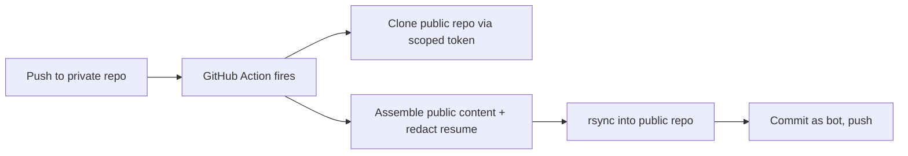

# Portfolio Publishing Pipeline

## Overview

A small CI/CD system that publishes a sanitized public portfolio site from a private source repo — cross-repo GitHub Actions automation, a single-source-of-truth content pipeline with no duplicated markdown, and an automated PII-redaction step that strips the phone number from the public résumé copy without maintaining two résumé files.

**Timeline:** Jul 2026 &middot; **Role:** Independent project
**Stack:** GitHub Actions, Python (PyMuPDF), rsync, vanilla JS (marked.js + mermaid.js)

---

## The Problem

Wanted a public portfolio site that stays in sync with a private working repo — real client write-ups, an in-progress résumé, internal notes — without duplicating content by hand or exposing anything private. Also wanted exactly one résumé file to maintain, not a public copy and a private copy that quietly drift apart over time.

## Architecture

**Two repos, one pipeline.** The private repo holds the real source: client write-ups (with real names, kept as an accurate personal record), independent-project docs, and the résumé. A GitHub Action fires on every relevant push, clones a separate public repo using a scoped access token, assembles just the public-facing content, syncs it in, commits under a bot identity, and pushes.

**No duplicated content.** The site's project pages don't contain any prose at all — each one is a thin HTML template that fetches its corresponding markdown file client-side and renders it in the browser, including live diagrams straight from `mermaid` code fences in the same file. Edit the markdown once; the site always reflects it.

**Automated PII redaction instead of two résumé files.** One tracked résumé PDF stays private, phone number included, for direct job applications. At publish time, a Python script finds the phone-number line by pattern, removes it, and re-justifies the remaining text to fill the original line width evenly — matching the underline beneath it — rather than leaving a visible gap. The public copy is generated fresh on every publish; nothing is hand-maintained.

## Technology Stack

| Layer | Tools |
|---|---|
| CI/CD | GitHub Actions (path-filtered triggers, manual dispatch) |
| Cross-repo publishing | `git clone` with a scoped access token, `rsync --delete` |
| PDF automation | Python, PyMuPDF (redact + re-justify the contact line) |
| Site rendering | Vanilla JS, marked.js (markdown), mermaid.js (diagrams) — no build step |

## Notable Engineering Decisions

- Content lives in exactly one place; the site is a rendering layer over it, not a copy
- PII redaction is a repeatable, automated step, not a manually-maintained second file that can drift out of sync with the real one
- Chose a plain `git clone` over the standard checkout action for the target repo specifically to handle a completely empty repo — the standard action fails when there's no branch to fetch yet

## Notable Bugs Found (and Fixed)

- **Empty target repo:** the standard checkout action failed on the public repo before its first commit existed, since there was no branch to fetch. Fixed by cloning manually instead.
- **`rsync --delete` was deleting `.git`:** the source content directory has no `.git` folder to match against, so `--delete` was removing the target repo's `.git` folder along with stale files — breaking the commit step entirely. Fixed by excluding `.git` from the sync.

## Status

Live and running — every push to the relevant paths in the private repo triggers a fresh publish, including a freshly-redacted résumé copy, with no manual steps in between.
