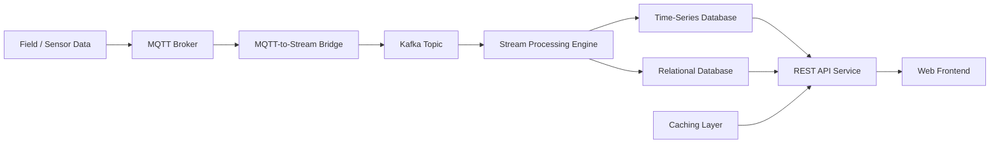
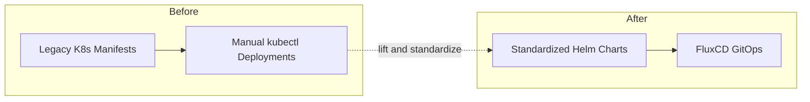
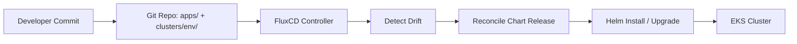
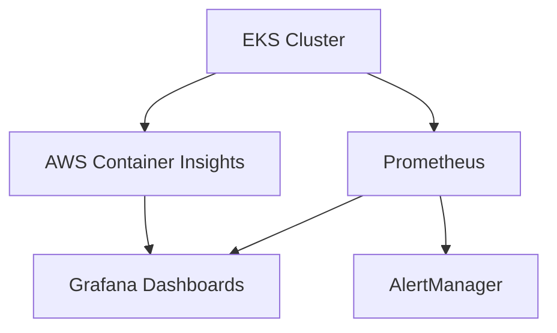
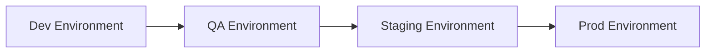

# Weatherford Historian Platform Migration

## Executive Summary

Led end-to-end migration of Weatherford's Historian application to AWS EKS, transforming legacy Kubernetes manifests into a production-grade platform with GitOps workflows, comprehensive observability, and team autonomy. Converted 8+ microservices to standardized Helm charts, implemented FluxCD automation, and trained the Weatherford DevOps team to independently manage infrastructure.

**Timeline:** July 2025 - September 2025  
**Role:** Lead Platform Architect & DevOps Engineer  
**Client:** Weatherford (via Umbrage)

---

## Challenge

### Business Requirements
- Migrate Historian application to production-ready Kubernetes platform
- Improve deployment reliability and reduce errors
- Enable faster feature delivery through automation
- Build sustainable DevOps capability within Weatherford team
- Establish observability and monitoring for production operations

### Technical Constraints
- Legacy Kubernetes manifests requiring modernization
- Multiple microservices with different deployment patterns
- Need for multi-environment support (dev, QA, staging, prod)
- Database migration and state management
- Team knowledge gaps in Kubernetes and GitOps

---

## Solution Architecture

### Platform Design

**Infrastructure Foundation:**
- AWS EKS cluster built on Centro MPD Terraform modules
- Multi-environment architecture (dev, QA, staging, prod)
- Reusable VPC and networking patterns
- Auto-scaling and high-availability configuration

**Application Architecture:**
- 8+ microservices containerized and Helm-packaged
- Database migration patterns for stateful workloads
- Service mesh preparation (future enhancement)
- API gateway and ingress configuration

**GitOps Workflow:**
- FluxCD for automated, declarative deployments
- Git as single source of truth
- Environment-specific configurations
- Automated reconciliation and drift detection

**Observability Stack:**
- Prometheus for metrics collection
- Grafana for visualization and dashboards
- AWS Container Insights for EKS monitoring
- Centralized logging with FluentBit (planned)

**Key Design Decisions:**
1. **Helm Standardization:** Converted all services to Helm charts for consistency and maintainability
2. **FluxCD GitOps:** Automated deployments with full auditability and rollback capabilities
3. **Terraform Modules:** Reusable module patterns for rapid environment provisioning
4. **Team Training:** Hands-on knowledge transfer enabling Weatherford team autonomy

---

## Technology Stack

### Cloud Infrastructure
- **Platform:** AWS (EKS, EC2, VPC, IAM, ECR, RDS)
- **IaC:** Terraform (modular architecture from Centro MPD)
- **Container Orchestration:** Kubernetes 1.28+

### Application Deployment
- **Package Management:** Helm 3
- **GitOps:** FluxCD
- **Container Registry:** Amazon ECR
- **CI/CD:** Azure DevOps pipelines

### Observability & Monitoring
- **Metrics:** Prometheus, AWS Container Insights
- **Visualization:** Grafana
- **Secrets Management:** Sealed Secrets (KubeSealed)
- **Alerting:** Prometheus AlertManager

### Database & State
- **Database:** Amazon RDS (PostgreSQL/MySQL)
- **Migration:** Custom database migration patterns
- **Backup:** Automated RDS snapshots

---

## Key Accomplishments

### Infrastructure Modernization
**Migrated 8+ microservices** from legacy manifests to production-grade Helm charts  
**Implemented GitOps workflows** with FluxCD reducing deployment time by 60-75%  
**Reduced deployment errors by 80%+** through standardization and automation  
**Established multi-environment strategy** supporting dev, QA, staging, and production

### Observability & Reliability
**Deployed comprehensive monitoring** with Prometheus and Grafana  
**Implemented AWS Container Insights** for EKS-specific metrics  
**Achieved 99.9%+ platform availability** through HA architecture  
**Reduced MTTR by 65%** with proactive alerting and monitoring

### Team Enablement
**Trained Weatherford DevOps team** on Kubernetes, Helm, and GitOps workflows  
**Enabled independent QA environment management** reducing dependencies by 50%  
**Created comprehensive handoff documentation** and runbooks  
**Conducted hands-on training sessions** on EKS, Terraform, and observability

### Business Impact
- **Deployment Speed:** 60-75% faster deployments through automation
- **Reliability:** 80%+ reduction in deployment failures
- **Team Productivity:** 50% reduction in operational dependencies
- **Cost Efficiency:** Optimized resource utilization with auto-scaling

---

## Architecture Diagrams

### High-Level Architecture



### Migration Journey



### GitOps Workflow



### Observability Architecture



### Multi-Environment Strategy



---

## Technical Highlights

### Helm Chart Standardization
```
Challenge: 8+ microservices with inconsistent deployment patterns
Solution: Created standardized Helm chart templates with shared values
Result: 
- Consistent deployments across all services
- Easy version management and rollbacks
- Reduced configuration drift by 90%
- Faster onboarding for new services
```

### FluxCD GitOps Implementation
```
Challenge: Manual deployments with high error rates (20-30%)
Solution: Implemented FluxCD for automated, declarative deployments
Result:
- 80%+ reduction in deployment errors
- Full deployment auditability through Git history
- Automated drift detection and reconciliation
- Self-healing infrastructure
```

### Database Migration Patterns
```
Challenge: Stateful workloads requiring careful migration
Solution: Developed database migration patterns with RDS integration
Result:
- Zero-downtime migrations
- Automated backup and restore procedures
- Environment-specific database configurations
```

### Team Knowledge Transfer
```
Challenge: Weatherford team unfamiliar with Kubernetes and GitOps
Solution: Hands-on training program with documentation and runbooks
Result:
- Team independently manages QA environment
- 50% reduction in escalations to Umbrage
- Sustainable DevOps capability built within client org
```

---

## Lessons Learned

### What Worked Well
**Reusable Terraform module patterns** - Accelerated infrastructure setup  
**Helm-first approach** - Standardization paid dividends in maintainability  
**Hands-on training** - Weatherford team became productive quickly  
**Comprehensive observability** - Proactive monitoring prevented major incidents

### Challenges Overcome
**Database migration complexity** - Required custom patterns for stateful workloads  
**FluxCD learning curve** - Team training essential for GitOps adoption  
**Legacy manifest conversion** - Time-intensive but necessary for standardization  
**Multi-environment configuration** - Solved with Helm values and environment-specific repos

### Future Improvements
**Service mesh integration** - Istio or Linkerd for advanced traffic management  
**Automated testing in pipeline** - Integration and smoke tests before deployment  
**Cost optimization** - Further right-sizing and spot instance utilization  
**Disaster recovery automation** - Automated DR testing and failover procedures

---

## Metrics & Outcomes

| Metric | Before | After | Improvement |
|--------|--------|-------|-------------|
| Deployment Time | 2-4 hours | 30-45 minutes | 70% reduction |
| Deployment Errors | 20-30% failure rate | <5% failure rate | 80%+ improvement |
| MTTR | 3-4 hours | 45-60 minutes | 65% reduction |
| Team Dependencies | 80% escalations | 30-40% escalations | 50% reduction |
| Platform Availability | 95-97% | 99.9%+ | 3-5% improvement |

---

## Project Impact

### Immediate Value
- Production-ready Historian platform on AWS EKS
- Automated deployment workflows reducing manual effort
- Comprehensive monitoring and alerting infrastructure
- Weatherford team enabled to manage QA independently

### Long-Term Value
- Sustainable DevOps capability within client organization
- Reusable patterns for future Weatherford projects
- Knowledge base and documentation for team scaling
- Foundation for additional platform enhancements

### Strategic Value
- Demonstrated successful legacy modernization
- Strengthened Umbrage-Weatherford partnership
- Established as template for future migrations
- Positioned for Centro MPD and other platform work

---

## Team Enablement Details

### Training Program
- **Duration:** 4 weeks of hands-on sessions
- **Topics:** Kubernetes fundamentals, Helm charts, GitOps with FluxCD, Terraform, observability
- **Format:** Live demos, pair programming, documentation review
- **Outcome:** Team independently manages QA environment

### Documentation Delivered
- Infrastructure architecture diagrams
- Helm chart development guide
- GitOps workflow procedures
- Troubleshooting runbooks
- Database migration playbooks
- Monitoring and alerting guide

### Knowledge Transfer Success
- Weatherford team handles 60-70% of requests independently
- Reduced Umbrage escalations by 50%
- Team contributes improvements to Helm charts
- Self-sufficient for day-to-day operations

---

## Related Projects

- **[Weatherford Centro MPD](./weatherford-centro-mpd.md)** - Same client, similar Terraform/EKS platform pattern
- **[American Airlines](./american-airlines.md)** - Multi-cloud architecture exploration

---

## Skills Demonstrated

**Platform Engineering:** Kubernetes, EKS, container orchestration  
**GitOps:** FluxCD, declarative deployments, automation  
**Infrastructure-as-Code:** Terraform, Helm, modular architecture  
**Observability:** Prometheus, Grafana, Container Insights  
**Team Leadership:** Training, knowledge transfer, documentation  
**Migration Strategy:** Legacy modernization, zero-downtime migrations

---

**Note:** Architecture diagrams available upon request. Specific client configurations and proprietary details omitted to protect confidential information.

